# AUTO_EDA — AI 驱动的 EDA 自动化平台

## 变更记录 (Changelog)

| 日期 | 版本 | 说明 |
|------|------|------|
| 2026-03-14 | 0.1.0 | 初始文档，由架构师扫描自动生成（基于全量研究文档阅读） |
| 2026-03-14 | 0.2.0 | 新增深度分析（DA1-DA7）、工作流引擎（A9）、开发规划（PLAN1-6）、长期路线图（P1）、新调研（NEW_R系列+KiCad专项），更新模块索引 |
| 2026-03-14 | 0.3.0 | Phase 0 代码脚手架完成：pyproject.toml、src/auto_eda/ 包结构、3个MCP Server（yosys/kicad/verilog_utils）、core层、tests/、AUDIT1-5审计报告 |

---

## 项目愿景

AUTO_EDA 旨在构建一套以 Claude + MCP（Model Context Protocol）协议为核心的 AI-EDA 自动化平台，将自然语言指令转化为真实 EDA 工具链操作。目标是成为**开源 EDA 生态的统一 AI 能力层**，让工程师通过对话式交互完成 PCB 设计、数字 IC 设计、HDL 仿真、电路仿真、物理设计等传统需要深度专业知识的 EDA 工作流。

**核心价值主张：**
- 供应商中立：优先集成开源 EDA 工具（KiCad、Yosys、OpenROAD、ngspice、KLayout、cocotb）
- 自然语言驱动 EDA 工作流编排（L3+ Agentic 级别）
- Claude 作为 AI 推理层，MCP 作为工具桥接层
- 全栈覆盖：PCB + 数字 IC + 模拟仿真（区别于现有只做数字 IC 的 MCP4EDA）
- 可视化反馈闭环：截图 → 分析 → 修改 → 验证（当前最大差异化点）

**当前阶段：Phase 0 代码脚手架已完成。** 22个Python源文件 + 7个测试文件已生成，3个MCP Server（Yosys/KiCad/VerilogUtils）骨架就绪，可安装依赖后直接运行。

---

## 架构总览

```
用户（自然语言）
     │
     ▼
  Claude（AI 推理层）
     │  MCP Protocol (JSON-RPC 2.0, stdio 传输)
     ▼
AUTO_EDA MCP 服务器集合（Python FastMCP + Pydantic + mypy strict）
     │
     ├── PCB Server          → KiCad v10 IPC API / kicad-cli Jobsets
     ├── Digital IC Server   → Yosys Pyosys + OpenROAD Python 绑定
     ├── Simulation Server   → Verilator + cocotb + ngspice/PySpice
     ├── Layout Server       → KLayout pya + gdstk
     ├── File Utils Server   → pyverilog / gdstk / liberty-parser
     └── Orchestrator        → LibreLane/OpenLane 全流程编排
```

**技术栈决策（已确认，见 analysis/A7_tech_stack_decision.md）：**
- MCP Server 语言：**Python**（FastMCP + Pydantic + mypy strict）
- 包管理：uv + pyproject.toml (hatchling)
- 代码质量：ruff (lint+format) + mypy strict
- 测试框架：pytest + pytest-asyncio
- 首批目标 EDA 工具：KiCad、Yosys、OpenROAD、cocotb、KLayout、ngspice
- 分发：PyPI 分层可选依赖（`auto-eda[pcb]`、`auto-eda[ic]`、`auto-eda[sim]`、`auto-eda[full]`）

---

## 模块结构图

```mermaid
graph TD
    A["(根) AUTO_EDA"] --> B["analysis/"]
    A --> C["research/"]
    A --> D[".mcp.json"]

    B --> B1["A1_technical_feasibility.md"]
    B --> B2["A2_market_positioning.md"]
    B --> B3["A4_risk_assessment.md"]
    B --> B4["A5_differentiation_strategy.md"]
    B --> B5["A7_tech_stack_decision.md"]
    B --> B6["A8_integration_roadmap.md"]

    C --> C1["R1_commercial_eda_vendors.md"]
    C --> C2["R2_opensource_eda_tools.md"]
    C --> C3["R3_eda_automation_apis.md"]
    C --> C4["R4_existing_mcp_servers.md"]
    C --> C5["R5_mcp_architecture.md"]
    C --> C6["R6_ai_eda_trends.md"]
    C --> C7["R7_eda_file_formats.md"]
    C --> C8["R8_claude_mcp_patterns.md"]
    C --> C9["R9_eda_workflow_automation.md"]
    C --> C10["R10_eda_llm_competitors.md"]

    click B "./analysis/CLAUDE.md" "查看 analysis 模块文档"
    click C "./research/CLAUDE.md" "查看 research 模块文档"
```



---

## 模块索引

| 模块路径 | 类型 | 一句话职责 | 文件数 | 状态 |
|----------|------|------------|--------|------|
| [analysis/](./analysis/CLAUDE.md) | 分析文档 | 技术可行性、市场定位、风险评估、技术栈决策、差异化策略、集成路线图（基础 6 份） | 6 | 已完成 |
| [analysis/ DA系列](./analysis/CLAUDE.md) | 深度分析 | DA1 架构深化、DA2 可视化反馈、DA3 Phase0规格、DA4 风险缓解、DA5 Claude-MCP集成、DA6 竞争深析、DA7 EDA知识体系 | 7 | 已完成 |
| [analysis/A9](./analysis/A9_workflow_engine_design.md) | 工作流引擎 | DAG 引擎设计、工作流模板、MCP 工具接口、跨工具数据传递 | 1 | 已完成 |
| [analysis/ PLAN系列](./analysis/CLAUDE.md) | 开发规划 | PLAN1 Phase0开发计划、PLAN2 代码架构规范、PLAN3 测试策略、PLAN4 社区运营、PLAN6 启动手册（Day 1 可执行） | 5 | 已完成 |
| [analysis/P1](./analysis/P1_phase_roadmap_detailed.md) | 长期路线图 | Phase 1-3 长期路线图细化（Month 3-12） | 1 | 已完成 |
| [analysis/ AUDIT系列](./analysis/AUDIT3_master_report.md) | 审计报告 | AUDIT1 一致性、AUDIT2 研究策略、AUDIT3 总统筹（北极星）、AUDIT4 AI集成、AUDIT5 代码质量 | 5 | 已完成 |
| [research/](./research/CLAUDE.md) | 调研文档 | EDA 工具调研、MCP 架构、AI-EDA 趋势、竞争对手、文件格式、工作流研究（原始 10 份） | 10 | 已完成 |
| [research/ NEW系列](./research/CLAUDE.md) | 新增调研 | NEW_R1 商业EDA现状、NEW_R2 开源EDA MCP现状、NEW_R3 MCP质量指南、NEW_R5 AI-EDA趋势、NEW_R6 EDA Python API、NEW_R7 MCP协议2025、NEW_R8 EDA社区、NEW_R9 EDA部署 | 8 | 已完成 |
| [research/kicad_mcp_integration_research.md](./research/kicad_mcp_integration_research.md) | KiCad专项 | KiCad v8/v9/v10 IPC API、Python脚本API、现有MCP实现、CLI Jobsets批处理 | 1 | 已完成 |
| `src/auto_eda/` | 源代码 | Phase 0 MCP Server 代码：core层（errors/process/base_server/result）+ 3个Server（yosys/kicad/verilog_utils）+ models | 22文件 | **Phase 0 完成** |
| `tests/` | 测试 | test_core/（errors）+ test_servers/（kicad/yosys）+ conftest.py | 7文件 | Phase 0 骨架完成 |
| `pyproject.toml` | 构建配置 | hatchling构建、分层依赖[pcb/ic/sim/dev/full]、ruff/mypy/pytest配置 | 1 | 已完成 |
| `.mcp.json` | 配置 | Claude Code 项目级 MCP 配置（当前挂载 grok-search 搜索服务器） | 1 | 已完成 |

---

## 运行与开发

> 当前阶段：Phase 0 代码脚手架已完成。安装依赖后可直接运行 MCP Server。

```bash
# 安装（开发模式）
uv sync --extra dev
# 或 pip install -e ".[dev]"

# 运行 Yosys MCP Server
python -m auto_eda yosys

# 运行 KiCad MCP Server
python -m auto_eda kicad

# 运行 Verilog Utils MCP Server
python -m auto_eda verilog

# 运行测试
pytest tests/ -v
```

### 当前 .mcp.json 配置

项目根目录已有 `.mcp.json`，配置了 `grok-search` MCP 服务器（用于调研阶段搜索，通过 uv 运行，依赖 GROK/Tavily/Firecrawl API Key）。正式开发时将在此文件中添加各 EDA MCP Server 的配置。

### 规划的开发阶段（来自 analysis/A8_integration_roadmap.md）

| 阶段 | 周期 | 内容 | 优先工具（加权评分） | 状态 |
|------|------|------|---------------------|------|
| Phase 0: MVP | Month 1-2 | Yosys MCP + KiCad MCP + Verilog 工具（~3 个 Server, ~30 个 Tools） | Yosys 8.65、KiCad 8.55 | **脚手架完成，待填充工具** |
| Phase 1: 核心工具链 | Month 3-4 | Verilator + cocotb + KLayout + GDSII 工具（+4 个 Server） | OpenROAD 8.55、cocotb 8.45 | 待开始 |
| Phase 2: 全流程 | Month 5-8 | OpenROAD + OpenSTA + ngspice + LibreLane 编排（+4 个 Server） | ngspice 7.85、KLayout 9.5 | 待开始 |
| Phase 3: 智能化 | Month 9-12 | 多 Agent 编排 + 可视化反馈闭环 + PPA 优化 | 跨工具编排 | 待开始 |

### 环境准备（开发时需要）

```bash
# Python 环境（推荐 uv）
uv init auto-eda && cd auto-eda
uv add "mcp[cli]" pydantic

# EDA 工具（Linux 推荐，Ubuntu/Debian）
apt install yosys openroad klayout ngspice verilator
pip install gdstk pyverilog pyspice

# KiCad（需单独安装 v9/v10）
# https://www.kicad.org/download/
```

---

## 测试策略

> 当前无测试代码，以下为规划策略（来自 analysis/A7_tech_stack_decision.md + research/R8_claude_mcp_patterns.md）。

**四层测试架构：**

| 层级 | 工具 | 覆盖范围 |
|------|------|----------|
| 单元测试 | pytest + pytest-asyncio | 工具参数验证、文件格式解析、数据转换 |
| 集成测试 | pytest + subprocess mock | MCP 工具调用完整流程、EDA CLI 交互 |
| 协议测试 | MCP Inspector | MCP 协议合规性验证 |
| 端到端测试 | Docker + 真实 EDA 工具 | 完整 EDA 工作流验证 |

**目标覆盖率：** 单元测试 >= 80%

---

## 编码规范

> 参考 analysis/A7_tech_stack_decision.md。

- **Python：** ruff (lint+format)、mypy strict 模式（强制全量类型注解）
- **MCP Tool 命名：** `动词_名词` 模式（snake_case），例如 `synthesize_rtl`、`run_drc`、`export_gerber`
- **参数验证：** 所有 MCP Tool 输入输出使用 Pydantic BaseModel
- **进程调用：** 短时任务用 `subprocess`，长时任务用 `asyncio.subprocess` + 进度报告
- **文件格式：** 优先使用 EDA 工具原生 Python API，不手动解析二进制格式
- **每个 MCP Server：** 5-15 个 Tools，单一职责，按 EDA 设计域划分

---

## 竞争格局与差异化

> 详见 analysis/A5_differentiation_strategy.md 和 analysis/A2_market_positioning.md。

**主要竞争对手：**
- **MCP4EDA**（NellyW8/MCP4EDA）：最直接竞争者，已有 Yosys+OpenLane+KLayout+Icarus+GTKWave，但仅覆盖数字 IC，无 PCB、无 SPICE 仿真、无多工具编排、无可视化反馈
- **Synopsys AgentEngineer / Cadence ChipStack**：商业闭源，绑定自家工具链，许可费 $150K+/席/年
- **ChipAgents**：$74M 融资，商业 SaaS，聚焦验证

**AUTO_EDA 核心差异化（5 大护城河）：**
1. 跨工具数据管道：统一中间格式，串联 PCB→IC→仿真全栈，商业工具不互通
2. 可视化反馈引擎：截图→LLM分析→工具修改→验证闭环，当前竞品均无此能力
3. 工作流模板生态：可分享、可复用的多步 EDA 工作流模板库
4. 领域知识飞轮：每次操作积累 EDA 领域知识，持续提升 AI 决策质量
5. 社区锁定效应：开源社区贡献形成生态壁垒，商业产品难以复制

---

## AI 使用指引

本项目本身即为 AI-EDA 平台，Claude 在开发过程中扮演关键角色：

**当前已配置的 MCP 工具（.mcp.json）：**
- `grok-search`：支持网络搜索（GROK + Tavily + Firecrawl），用于研究阶段信息收集

**开发阶段 Claude 使用建议：**
- 架构决策：参考 analysis/ 目录下的 6 份分析文档，尤其是 A7（技术栈）和 A8（路线图）
- 工具集成顺序：严格按 A8 优先级矩阵执行（Yosys → KiCad → OpenROAD → cocotb 顺序）
- 风险规避：高风险项（T7 LLM 幻觉、T1 KiCad API 不稳定）需在实现时做好防护
- 代码生成：所有 MCP Tool 实现必须含 Pydantic 参数验证 + mypy 类型注解
- 测试生成：每个新 Tool 同步生成单元测试，不积累测试债务
