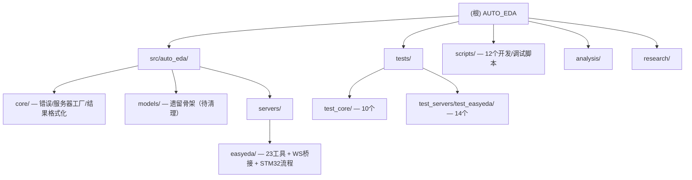

# AUTO_EDA — AI 驱动的 EDA 自动化平台

## 变更记录 (Changelog)

| 日期 | 版本 | 说明 |
|------|------|------|
| 2026-03-14 | 0.1.0 | 初始文档，架构师扫描自动生成 |
| 2026-03-14 | 0.2.0 | 新增DA1-DA7、A9、PLAN1-6、P1、NEW_R系列 |
| 2026-03-14 | 0.3.0 | Phase 0 脚手架完成：pyproject.toml、core层、3个Server骨架、AUDIT1-5 |
| 2026-03-14 | 0.4.0 | EasyEDA MCP Server 完成（commit 3cad6da）：23工具、14步STM32流程、WS桥接架构调试完毕、LCSC UUID预置、测试完整 |
| 2026-03-15 | 0.5.0 | 深度扫描更新：99文件/24测试全通过/CI管线/scripts文档化/已知问题修正 |

---

## 项目愿景

AUTO_EDA 是**专注嘉立创EDA Pro** 的开源 AI 自动化项目，通过 Claude + MCP 协议将自然语言指令转化为真实 EDA 操作。

**核心价值：** 自然语言驱动 PCB 设计、嘉立创生态深度集成（LCSC 元件库 + JLCPCB 制造）、全自动设计流程。

**当前阶段：** 23 个 MCP 工具、14 步 STM32 最小系统板全自动流程已完成可用。

---

## 架构总览

```
Claude (AI) → MCP stdio → EasyEDA Server (Python FastMCP, 23 tools)
                              │ WS Server ws://127.0.0.1:9050
                              ▼
                    jlc-bridge.eext v0.0.17  (WS Client)
                              │ globalThis.eda.* API
                              ▼
                    嘉立创EDA Pro v3.2.91
```

**已验证关键点：** EDA扩展是WS客户端，Server是服务端。`eda.invoke` 格式：`{"path":"Class.method","args":[...]}`。LCSC库UUID：`0819f05c4eef4c71ace90d822a990e87`。

**技术栈：** Python + FastMCP + Pydantic + mypy strict + ruff + pytest-asyncio + websockets>=13.0

---

## 项目统计（v0.5.0 深度扫描）

| 指标 | 数值 |
|------|------|
| 总文件数 | 99（排除 `.git`/`__pycache__`/缓存） |
| Python 源码 | 13 文件 ~2100 LOC（`src/auto_eda/`） |
| 测试用例 | **24 个**（10 core + 6 bridge + 8 stm32_flow）|
| 测试状态 | **全部通过**（pytest 3.13s） |
| 分析文档 | 21 份（`analysis/`）|
| 调研文档 | 19 份（`research/`）|
| 开发脚本 | 12 个 526 LOC（`scripts/`）|
| MCP 工具 | 23 个（EasyEDA Server）|
| Pydantic 模型 | 36 个（34 in models.py + 2 in server.py）|
| CI 管线 | GitHub Actions: ruff + mypy + pytest×3（Python 3.10/3.11/3.12）|

## 模块结构图



---

## 模块索引

| 模块路径 | 类型 | 一句话职责 | 文件数 | 状态 |
|----------|------|------------|--------|------|
| [src/auto_eda/core/](./src/auto_eda/core/CLAUDE.md) | 核心库 | EDAErrorCode+6异常类、MCP服务器工厂、结果格式化 | 5 | 完成 |
| [src/auto_eda/servers/easyeda/](./src/auto_eda/servers/easyeda/CLAUDE.md) | MCP Server | 23工具（原理图/PCB/导出/全流程）+ WS桥接 + STM32 14步流程 | 6 | **完成已发布** |
| [src/auto_eda/models/](./src/auto_eda/models/CLAUDE.md) | 遗留骨架 | Verilog HDL 模型（早期多EDA规划遗留，当前未使用） | 2 | 待清理 |
| [tests/](./tests/CLAUDE.md) | 测试 | 24个测试：core错误×10、EDABridge×6、STM32流程×8 | 7 | **全通过** |
| [scripts/](./scripts/CLAUDE.md) | 开发脚本 | 12个EDA连接/API探索/UUID获取/坐标校准/流程测试脚本 | 12 | 完成 |
| [analysis/](./analysis/CLAUDE.md) | 分析文档 | 21+份：可行性/市场/风险/技术栈/路线图/架构/AUDIT | 27 | 完成 |
| [research/](./research/CLAUDE.md) | 调研文档 | 19份：商业EDA/开源工具/MCP生态/AI趋势/KiCad专项 | 20 | 完成 |
| `pyproject.toml` | 构建 | hatchling + 分层依赖[dev] + ruff/mypy/pytest + Python>=3.10 | 1 | 完成 |
| `.github/workflows/ci.yml` | CI | GitHub Actions: ruff lint + mypy strict + pytest×3版本 | 1 | 完成 |
| `.mcp.json` | MCP配置 | Claude Code项目级MCP配置（grok-search） | 1 | 完成 |

---

## 运行与开发

```bash
pip install -e ".[dev]"          # 安装开发依赖
python -m auto_eda easyeda       # 启动 EasyEDA MCP Server (stdio)
pytest tests/ -v                  # 运行全部测试
pytest tests/ -v -m "not integration"  # 仅单元测试
```

**Claude Desktop 配置：**
```json
{"mcpServers":{"auto-eda-easyeda":{"command":"python","args":["-m","auto_eda","easyeda"]}}}
```

**前置要求：** Python 3.10+、嘉立创EDA Pro v3.2.91+、JLCEDA MCP Bridge扩展 v0.0.17+（EDA扩展广场安装）。

**开发路线图（嘉立创EDA 专项）：**

| 阶段 | 内容 | 状态 |
|------|------|------|
| v0.1: 基础能力 | 23工具 + STM32 全自动流程 | **已完成** |
| v0.2: 完善打磨 | 更多板级模板、ERC/DRC 智能修复、可视化反馈闭环 | 待开始 |
| v0.3: 生态集成 | JLCPCB 一键下单、LCSC BOM 智能选型、多板支持 | 待开始 |
| v1.0: 发布 | PyPI 发布、文档站点、社区贡献指南 | 待开始 |

---

## 测试策略

| 层级 | 工具 | 覆盖范围 | 目标 |
|------|------|----------|------|
| 单元测试 | pytest + pytest-asyncio | 错误类、Pydantic模型、工具函数 | >=80% |
| 集成测试 | pytest + mock bridge | MCP工具调用完整流程 | 关键路径 |
| 协议测试 | MCP Inspector | MCP协议合规性 | 全工具 |
| 端到端测试 | 真实EDA客户端 | STM32全流程验证 | 发布前 |

---

## 编码规范

- **Python：** ruff (lint+format)、mypy strict（强制全量类型注解）
- **MCP Tool命名：** `动词_名词` snake_case，如 `sch_place_symbol`、`pcb_run_drc`
- **参数验证：** 所有Tool输入输出使用 Pydantic BaseModel，含 `suggested_next_steps`
- **异常处理：** `@eda_tool` 装饰器统一捕获 EDAError 并格式化为 MCP 错误文本
- **WS命令：** 通过 `EDABridge.send_command()` / `eda_invoke()` 发送，含超时保护

---

## AI 使用指引

- **EasyEDA工具使用：** 先调用 `eda_ping` 确认连接，再调用具体工具；STM32全流程用 `draw_stm32_minimum_system`
- **项目范围：** 本项目**只做嘉立创EDA**，不涉及 KiCad/Yosys/OpenROAD 等其他 EDA 工具
- **新增工具：** 必须含 Pydantic 验证 + `@eda_tool` 装饰器 + 同步编写单元测试
- **已配置MCP：** `grok-search`（GROK+Tavily+Firecrawl）用于研究阶段
- **遗留代码：** `models/verilog.py`、`core/process.py`（subprocess runner）、errors.py 中 3xxx/4xxx/5xxx 错误码为早期多EDA规划遗留，当前未使用

---

## 已知问题（v0.5.0 扫描发现）

| 问题 | 严重度 | 位置 | 说明 |
|------|--------|------|------|
| `logger` 使用先于定义 | 低 | `servers/easyeda/server.py:61` vs `:70` | `_start_ws_server_thread()` 引用 `logger`，但定义在行70。不阻塞运行（线程启动后才执行），但应修复 |
| conftest fixture 字段错误 | 低 | `tests/conftest.py:34` | `ProcessResult(timed_out=False)` — `ProcessResult` 无 `timed_out` 字段，该 fixture 未被当前测试使用 |
| `models/__init__.py` 为空 | 低 | `src/auto_eda/models/__init__.py` | 无导出，Phase 1 需填充 |
| pyproject.toml 依赖简化 | 信息 | `pyproject.toml:31-38` | 原设计有 `[pcb/ic/sim/full]` 分层，当前仅 `[dev]`，Phase 1 需补充 |
| 多EDA遗留代码 | 信息 | `models/verilog.py`, `core/process.py`, `errors.py:22-39` | 早期多EDA规划遗留，EasyEDA 不使用 subprocess runner 和 3xxx/4xxx/5xxx 错误码，可在清理时移除 |
