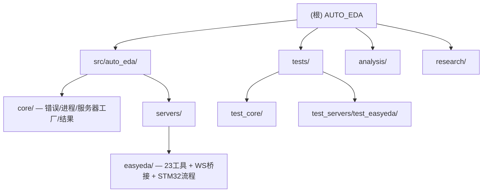

# AUTO_EDA — AI 驱动的 EDA 自动化平台

## 变更记录 (Changelog)

| 日期 | 版本 | 说明 |
|------|------|------|
| 2026-03-14 | 0.1.0 | 初始文档，架构师扫描自动生成 |
| 2026-03-14 | 0.2.0 | 新增DA1-DA7、A9、PLAN1-6、P1、NEW_R系列 |
| 2026-03-14 | 0.3.0 | Phase 0 脚手架完成：pyproject.toml、core层、3个Server骨架、AUDIT1-5 |
| 2026-03-14 | 0.4.0 | EasyEDA MCP Server 完成（commit 3cad6da）：23工具、14步STM32流程、WS桥接架构调试完毕、LCSC UUID预置、测试完整 |

---

## 项目愿景

AUTO_EDA 是以 Claude + MCP 协议为核心的 AI-EDA 自动化平台，将自然语言指令转化为真实 EDA 工具链操作。目标成为**开源 EDA 生态的统一 AI 能力层**。

**核心价值：** 供应商中立、自然语言驱动、全栈覆盖（PCB+数字IC+模拟仿真）、可视化反馈闭环。

**当前阶段：EasyEDA MCP Server 已完成（commit `3cad6da`）。** 23个MCP工具、14步STM32最小系统板全自动流程可直接使用。

---

## 架构总览

```
Claude (AI) → MCP stdio → EasyEDA Server (Python FastMCP, 23 tools)
                              │ WS Server ws://127.0.0.1:9050
                              ▼
                    jlc-bridge.eext v0.0.17  (WS Client)
                              │ globalThis.eda.* API
                              ▼
                    嘉立创EDA Pro v3.2.91
```

**已验证关键点：** EDA扩展是WS客户端，Server是服务端。`eda.invoke` 格式：`{"path":"Class.method","args":[...]}`。LCSC库UUID：`0819f05c4eef4c71ace90d822a990e87`。

**技术栈：** Python + FastMCP + Pydantic + mypy strict + ruff + pytest-asyncio + websockets>=13.0

---

## 模块结构图



---

## 模块索引

| 模块路径 | 类型 | 一句话职责 | 文件数 | 状态 |
|----------|------|------------|--------|------|
| [src/auto_eda/core/](./src/auto_eda/core/CLAUDE.md) | 核心库 | EDAErrorCode+5异常类、异步子进程、MCP服务器工厂、结果格式化 | 4 | 完成 |
| [src/auto_eda/servers/easyeda/](./src/auto_eda/servers/easyeda/CLAUDE.md) | MCP Server | 23工具（原理图/PCB/导出/全流程）+ WS桥接 + STM32 14步流程 | 6 | **完成已发布** |
| [src/auto_eda/models/](./src/auto_eda/models/CLAUDE.md) | 数据模型 | Verilog HDL Pydantic模型（供未来Yosys Server使用） | 2 | 骨架 |
| [tests/](./tests/CLAUDE.md) | 测试 | EDABridge×6、STM32流程×6、core错误×10 | 7 | 完成 |
| [analysis/](./analysis/CLAUDE.md) | 分析文档 | 21+份：可行性/市场/风险/技术栈/路线图/架构/AUDIT | 21+ | 完成 |
| [research/](./research/CLAUDE.md) | 调研文档 | 19份：商业EDA/开源工具/MCP生态/AI趋势/KiCad专项 | 19 | 完成 |
| `pyproject.toml` | 构建 | hatchling + 分层依赖[dev/pcb/ic/sim/full] + ruff/mypy/pytest | 1 | 完成 |
| `.mcp.json` | MCP配置 | Claude Code项目级MCP配置（grok-search） | 1 | 完成 |

---

## 运行与开发

```bash
pip install -e ".[dev]"          # 安装开发依赖
python -m auto_eda easyeda       # 启动 EasyEDA MCP Server (stdio)
pytest tests/ -v                  # 运行全部测试
pytest tests/ -v -m "not integration"  # 仅单元测试
```

**Claude Desktop 配置：**
```json
{"mcpServers":{"auto-eda-easyeda":{"command":"python","args":["-m","auto_eda","easyeda"]}}}
```

**前置要求：** Python 3.11+、嘉立创EDA Pro v3.2.91+、JLCEDA MCP Bridge扩展 v0.0.17+（EDA扩展广场安装）。

**开发路线图：**

| 阶段 | 周期 | 内容 | 状态 |
|------|------|------|------|
| Phase 0: EasyEDA | Month 1-2 | 23工具 + STM32全自动流程 | **已完成** |
| Phase 1: 核心工具链 | Month 3-4 | Yosys + KiCad + OpenROAD MCP Server | 待开始 |
| Phase 2: 全流程 | Month 5-8 | cocotb + KLayout + ngspice | 待开始 |
| Phase 3: 智能化 | Month 9-12 | 多Agent编排 + 可视化反馈闭环 | 待开始 |

---

## 测试策略

| 层级 | 工具 | 覆盖范围 | 目标 |
|------|------|----------|------|
| 单元测试 | pytest + pytest-asyncio | 错误类、Pydantic模型、工具函数 | >=80% |
| 集成测试 | pytest + mock bridge | MCP工具调用完整流程 | 关键路径 |
| 协议测试 | MCP Inspector | MCP协议合规性 | 全工具 |
| 端到端测试 | 真实EDA客户端 | STM32全流程验证 | 发布前 |

---

## 编码规范

- **Python：** ruff (lint+format)、mypy strict（强制全量类型注解）
- **MCP Tool命名：** `动词_名词` snake_case，如 `sch_place_symbol`、`pcb_run_drc`
- **参数验证：** 所有Tool输入输出使用 Pydantic BaseModel，含 `suggested_next_steps`
- **异常处理：** `@eda_tool` 装饰器统一捕获 EDAError 并格式化为 MCP 错误文本
- **WS命令：** 通过 `EDABridge.send_command()` / `eda_invoke()` 发送，含超时保护

---

## AI 使用指引

- **EasyEDA工具使用：** 先调用 `eda_ping` 确认连接，再调用具体工具；STM32全流程用 `draw_stm32_minimum_system`
- **架构决策：** 参考 `analysis/A7`（技术栈）和 `analysis/A8`（路线图）
- **风险规避：** T7 LLM幻觉（验证返回值）、T1 KiCad API不稳定（version.py隔离层）
- **新增工具：** 必须含 Pydantic 验证 + `@eda_tool` 装饰器 + 同步编写单元测试
- **已配置MCP：** `grok-search`（GROK+Tavily+Firecrawl）用于研究阶段
